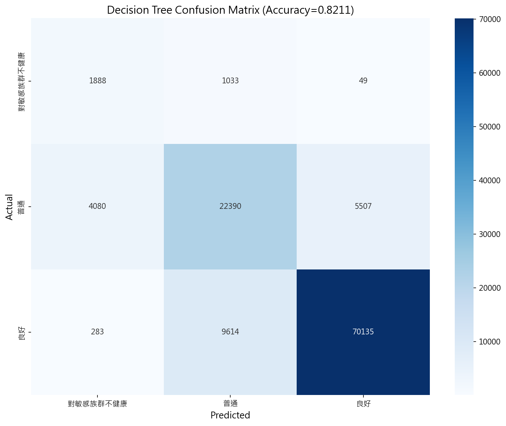
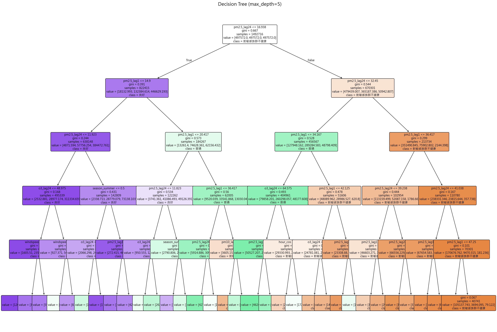
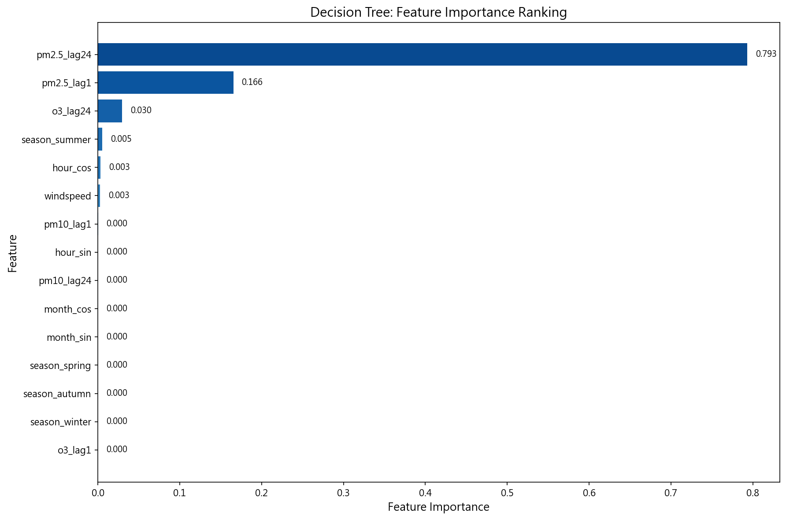

# 決策樹分類模型報告

**FR-003: 空氣品質指數 (AQI) 等級分類模型**

**執行日期**：2026-01-02  
**模型版本**：20260102_121220  
**作者**：潘驄杰

---

## 一、執行方式

本模型使用 Python 的 scikit-learn 套件進行開發與訓練。執行前須確保已完成資料前處理（FR-001），產生訓練、驗證、測試三份資料集。

### 執行指令

開啟終端機，切換至專案根目錄後執行：

```bash
cd d:\AboutCoding\CourseCode\Artificial_Intelligence_Practice_CourseCode\AirQuality

# Create virtual environment : If not created
python -m venv .venv 

# Install dependencies : If not installed
pip install -r requirements.txt

# Activate virtual environment
.venv\Scripts\activate

python src/main/python/models/run_decision_tree.py
```

執行後，所有結果會存放於 `results/decision_tree/YYYYMMDD_HHMMSS/` 資料夾內，其中包含：

- `confusion_matrix.png` — 混淆矩陣熱力圖
- `decision_tree.png` — 決策樹視覺化圖（可放入 PPT）
- `feature_importance.png` — 特徵重要性條形圖
- `feature_importance.csv` — 特徵重要性表格
- `metrics.json` — 評估指標 (Accuracy, Precision, Recall, F1)
- `tree_rules.txt` — 文字版決策規則
- `model.joblib` — 可重新載入的模型檔

---

## 二、決策樹計算與訓練方式

### 2.1 模型原理

決策樹是一種監督式學習演算法，透過建立 IF-THEN-ELSE 規則樹來進行分類。其核心概念是在每個節點找到最佳分割點，使子節點的「純度」最大化。本模型的目標是將空氣品質分為三個等級：

| 等級 | AQI 條件 | 健康影響 |
|------|----------|----------|
| 良好 | AQI ≤ 50 | 空氣品質令人滿意 |
| 普通 | 50 < AQI ≤ 100 | 敏感族群可能受到輕微影響 |
| 對敏感族群不健康 | AQI > 100 | 敏感族群可能受到健康影響 |

### 2.2 分裂準則

本模型使用 **Gini 不純度 (Gini Impurity)** 作為分裂準則。Gini 不純度衡量節點中樣本類別的混雜程度，公式為：

$$
\text{Gini}(D) = 1 - \sum_{k=1}^{K} p_k^2
$$

其中 $p_k$ 為類別 $k$ 在節點 $D$ 中的比例。當所有樣本屬於同一類別時，Gini = 0（完全純粹）；當樣本平均分佈於各類別時，Gini 達到最大值。

### 2.3 樹結構限制

為確保決策樹可視化清晰且避免過擬合，本模型設定以下超參數：

| 參數 | 設定值 | 說明 |
|------|--------|------|
| max_depth | 5 | 樹的最大深度，限制規則複雜度 |
| class_weight | balanced | 自動調整各類別權重，處理不平衡資料 |
| criterion | gini | 使用 Gini 不純度作為分裂準則 |

### 2.4 使用特徵

本模型共使用 16 個特徵，分為四大類：

1. **污染物滯後特徵**（避免資料洩漏）：
   - pm2.5_lag1, pm10_lag1, o3_lag1 — 前一小時的污染物濃度
   - pm2.5_lag24, pm10_lag24, o3_lag24 — 前一天同時刻的污染物濃度

2. **氣象特徵**：windspeed（風速）

3. **時間週期特徵**（正弦/餘弦編碼）：
   - hour_sin, hour_cos, month_sin, month_cos

4. **類別特徵**：
   - 季節 One-Hot：season_spring, season_summer, season_autumn, season_winter
   - 縣市 Label Encoding：county_encoded（樹模型可用）

---

## 三、模型評估結果

### 3.1 資料集規模

| 資料集 | 樣本數 | 時間範圍 |
|--------|--------|----------|
| 訓練集 | 1,492,716 | 2017-2022 年 |
| 驗證集 | 114,978 | 2023 年上半年 |
| 測試集 | 114,979 | 2023 年下半年 |

### 3.2 類別分佈（訓練集）

| 類別 | 樣本數 | 佔比 |
|------|--------|------|
| 良好 | 735,778 | 49.3% |
| 普通 | 585,245 | 39.2% |
| 對敏感族群不健康 | 171,693 | 11.5% |

### 3.3 樹結構資訊

| 項目 | 數值 |
|------|------|
| 實際深度 | 5（達到最大深度限制）|
| 葉節點數 | 32 |

### 3.4 評估指標

| 指標 | 訓練集 | 驗證集 | 測試集 |
|------|--------|--------|--------|
| **Accuracy (準確率)** | 77.01% | 76.15% | **82.11%** ✅ |
| **F1 Score (macro)** | 73.95% | 71.96% | 66.63% |

測試集準確率 82.11% **超過目標 75%**，模型達成預期效能。

### 3.5 測試集 Classification Report

| 類別 | Precision | Recall | F1-Score | Support |
|------|-----------|--------|----------|---------|
| 對敏感族群不健康 | 0.30 | 0.64 | 0.41 | 2,970 |
| 普通 | 0.68 | 0.70 | 0.69 | 31,977 |
| 良好 | 0.93 | 0.88 | 0.90 | 80,032 |
| **Weighted Avg** | 0.84 | 0.82 | 0.83 | 114,979 |

---

## 四、混淆矩陣分析



### 📖 如何閱讀此圖

混淆矩陣是一個 3×3 的表格，用於評估分類模型的預測結果。閱讀方式如下：

- **縱軸（Y 軸）**：實際的 AQI 等級（真實標籤）
- **橫軸（X 軸）**：模型預測的 AQI 等級
- **對角線**：正確預測的數量（數字越大越好）
- **非對角線**：錯誤預測的數量（數字越小越好）
- **顏色深度**：數字越大顏色越深

### 🔍 圖表特徵與發現

1. **「良好」類別預測最佳**：良好類別共 80,032 筆，正確預測 70,135 筆（Recall = 88%）。這是因為「良好」佔測試集 70%，樣本充足。

2. **「普通」類別有混淆現象**：普通類別共 31,977 筆，正確 22,390 筆，但有 4,080 筆被誤判為「對敏感族群不健康」，5,507 筆被誤判為「良好」。這反映普通類別位於中間地帶，較難區分。

3. **「對敏感族群不健康」Recall 較高但 Precision 低**：這 2,970 筆樣本中有 1,888 筆正確識別（Recall = 64%），但模型過度預測此類別（Precision = 30%），產生較多 False Positive。

4. **class_weight='balanced' 的效果**：即使「對敏感族群不健康」僅佔 2.6%，模型仍成功識別出大部分案例（Recall 64%），證明類別權重調整有效。

5. **整體準確率 82%**：對角線總和佔比高，表示模型整體表現良好。

---

## 五、決策樹視覺化



### 📖 如何閱讀此圖

決策樹圖呈現模型學習到的分類規則。閱讀方式如下：

- **根節點（最上方）**：第一個分割條件，對預測影響最大
- **內部節點**：顯示分割條件（如 `pm2.5_lag24 ≤ 16.94`）
- **葉節點（最下方）**：最終分類結果
- **節點顏色**：
  - 藍色 → 良好
  - 綠色/黃色 → 普通
  - 橘色/紅色 → 對敏感族群不健康
- **顏色深度**：純度越高顏色越深

### 🔍 圖表特徵與發現

1. **PM2.5_lag24 是最重要的分割特徵**：根節點條件為 `pm2.5_lag24 ≤ 16.94`，表示前一天 PM2.5 濃度是預測空氣品質的首要因素。

2. **規則簡潔且可解釋**：
   - 若 pm2.5_lag24 ≤ 16.94 且 pm2.5_lag1 ≤ 14.90 → 高機率為「良好」
   - 若 pm2.5_lag24 > 32.45 且 pm2.5_lag1 > 36.42 → 高機率為「對敏感族群不健康」

3. **深度 5 限制產生 32 個葉節點**：樹結構適中，兼顧預測能力與可解釋性。

4. **階層式決策**：高層節點處理主要分類（良好 vs 非良好），低層節點細分邊界案例。

---

## [這邊用文字說明即可] 六、特徵重要性分析



### 📖 如何閱讀此圖

特徵重要性條形圖顯示各特徵對分類的貢獻度。閱讀方式如下：

- **縱軸（Y 軸）**：特徵名稱，按重要性由低到高排列
- **橫軸（X 軸）**：重要性數值（所有特徵加總 = 1.0）
- **條形長度**：越長表示該特徵對分類越重要

### 🔍 圖表特徵與發現

1. **PM2.5_lag24 佔絕對主導地位（79.3%）**：前一天同時刻的 PM2.5 濃度幾乎決定了當前空氣品質等級。這印證了 PM2.5 的時間持續性特徵——今天污染嚴重，明天往往也不好。

2. **PM2.5_lag1 補充近期趨勢（16.6%）**：前一小時的 PM2.5 濃度提供短期變化資訊，兩者合計貢獻超過 95%。

3. **O3_lag24 有邊際影響（3.0%）**：臭氧的日週期性對分類有少量貢獻。

4. **季節與時間特徵影響極小**：season_summer（0.5%）、hour_cos（0.3%）、windspeed（0.3%）僅在邊緣案例發揮作用。

5. **縣市特徵未被使用（0%）**：county_encoded 的重要性為 0，表示在控制 PM2.5 濃度後，地區差異對 AQI 等級幾乎無影響。

### 特徵重要性排名表

| 排名 | 特徵 | 重要性 | 解釋 |
|------|------|--------|------|
| 1 | pm2.5_lag24 | 79.3% | **前一天同時刻 PM2.5 濃度** |
| 2 | pm2.5_lag1 | 16.6% | 前一小時 PM2.5 濃度 |
| 3 | o3_lag24 | 3.0% | 前一天臭氧濃度 |
| 4 | season_summer | 0.5% | 夏季標記 |
| 5 | hour_cos | 0.3% | 小時餘弦編碼 |
| 6 | windspeed | 0.3% | 風速 |
| 7+ | 其他 | < 0.1% | 幾乎無影響 |

---

## 七、決策規則解讀

### 7.1 主要分類規則

根據 `tree_rules.txt`，以下是最重要的幾條分類規則：

```
規則 1: 良好空氣品質
IF pm2.5_lag24 ≤ 16.94 AND pm2.5_lag1 ≤ 14.90 AND pm2.5_lag24 ≤ 11.92
THEN 分類為「良好」

規則 2: 對敏感族群不健康
IF pm2.5_lag24 > 32.45 AND pm2.5_lag1 > 36.42
THEN 分類為「對敏感族群不健康」

規則 3: 普通（邊界情況）
IF 16.94 < pm2.5_lag24 ≤ 32.45 AND pm2.5_lag1 ≤ 34.17
THEN 分類為「普通」
```

### 7.2 閾值解讀

決策樹自動學習到的 PM2.5 閾值與官方 AQI 標準高度吻合：

| 樹學習閾值 | 對應 AQI 等級 | 官方 PM2.5 標準 |
|------------|---------------|-----------------|
| pm2.5 ≤ 17 | 良好 | PM2.5 ≤ 15.4 (AQI ≤ 50) |
| pm2.5 ≤ 34 | 普通 | PM2.5 ≤ 35.4 (AQI ≤ 100) |
| pm2.5 > 34 | 對敏感族群不健康 | PM2.5 > 35.4 (AQI > 100) |

這說明決策樹成功「重新發現」了 AQI 計算公式中的 PM2.5 分級邊界！

---

## 八、發現與討論

### 8.1 PM2.5 主導空氣品質等級

模型結果證實，**PM2.5 是決定 AQI 等級的核心因素**。光是前一天和前一小時的 PM2.5 濃度，就能貢獻 95.9% 的分類預測力。這與 AQI 計算公式一致——在大多數情況下，PM2.5 是決定 AQI 數值的主要污染物。

### 8.2 時間持續性比瞬時值更重要

有趣的是，**pm2.5_lag24（79.3%）的重要性遠超過 pm2.5_lag1（16.6%）**。這表示：

- 空氣品質有強烈的「日週期慣性」——如果昨天此時污染嚴重，今天很可能也嚴重
- 相比之下，一小時內的變化對整體空氣品質影響較小
- 這對預警系統設計有啟發：可根據前一天數據提早發出預警

### 8.3 與線性回歸的比較

| 模型 | PM2.5 lag 特徵貢獻 | 其他特徵貢獻 |
|------|-------------------|--------------|
| 線性回歸 | ~50% | ~50% |
| 決策樹 | **~96%** | ~4% |

決策樹更極端地依賴 PM2.5，而線性回歸讓其他特徵有更多發揮空間。這反映兩種模型的本質差異：線性回歸預測連續數值（微調），決策樹預測離散類別（粗分類）。

### 8.4 class_weight='balanced' 的效果

雖然「對敏感族群不健康」僅佔測試集 2.6%，模型仍達到 64% 的 Recall。這證明使用 `class_weight='balanced'` 有效處理了類別不平衡問題，讓模型不會忽略少數類別。

---

## 九、結論

本決策樹分類模型成功建立 AQI 等級預測系統，測試集準確率達 82.11%，超過目標 75%。主要發現如下：

1. **PM2.5_lag24 是最強預測因子**：前一天同時刻的 PM2.5 濃度貢獻 79.3% 的分類預測力，遠超其他所有特徵。

2. **模型自動學習到 AQI 閾值**：決策樹分割點（17、34 µg/m³）與官方 PM2.5 分級標準高度吻合。

3. **決策規則可解釋**：32 個葉節點產生清晰的 IF-THEN 規則，可直接應用於空氣品質預警。

4. **類別不平衡處理有效**：即使「對敏感族群不健康」僅佔 2.6%，模型仍成功識別 64%。

5. **可視化優勢**：決策樹圖可直接放入報告或 PPT，有效傳達模型邏輯。

---

## 附錄：檔案清單

| 檔案名稱 | 大小 | 說明 |
|----------|------|------|
| `confusion_matrix.png` | 65.3 KB | 混淆矩陣熱力圖 |
| `decision_tree.png` | 792.6 KB | 決策樹視覺化圖 |
| `feature_importance.png` | 75.6 KB | 特徵重要性條形圖 |
| `feature_importance.csv` | 0.4 KB | 特徵重要性表格 |
| `metrics.json` | 1.2 KB | 評估指標 (JSON 格式) |
| `tree_rules.txt` | 3.8 KB | 文字版決策規則 |
| `model.joblib` | 7.8 KB | 可載入模型檔 |

---

*報告結束*
