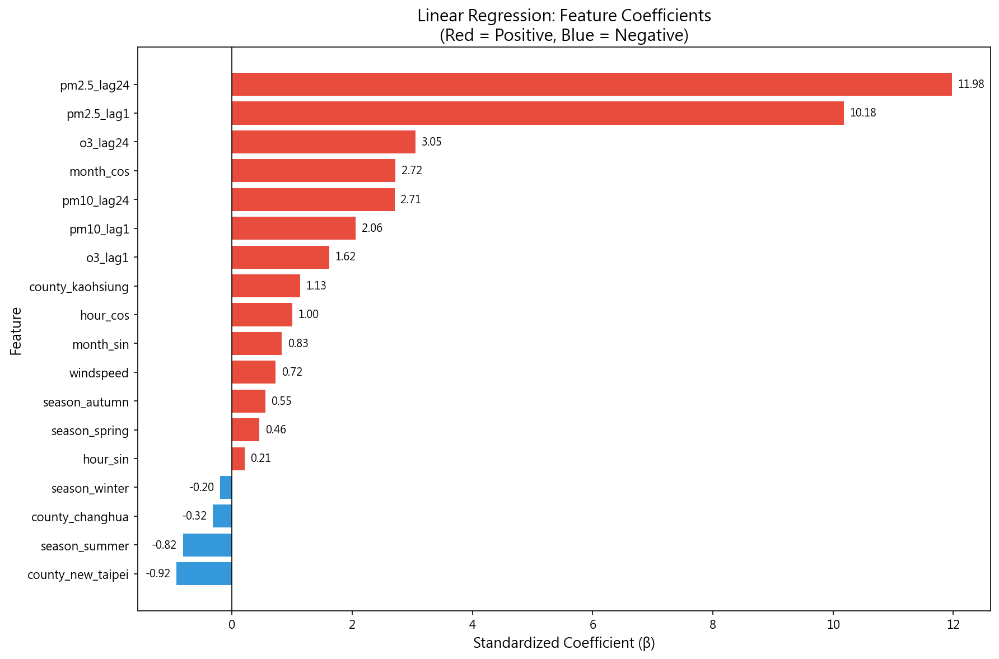
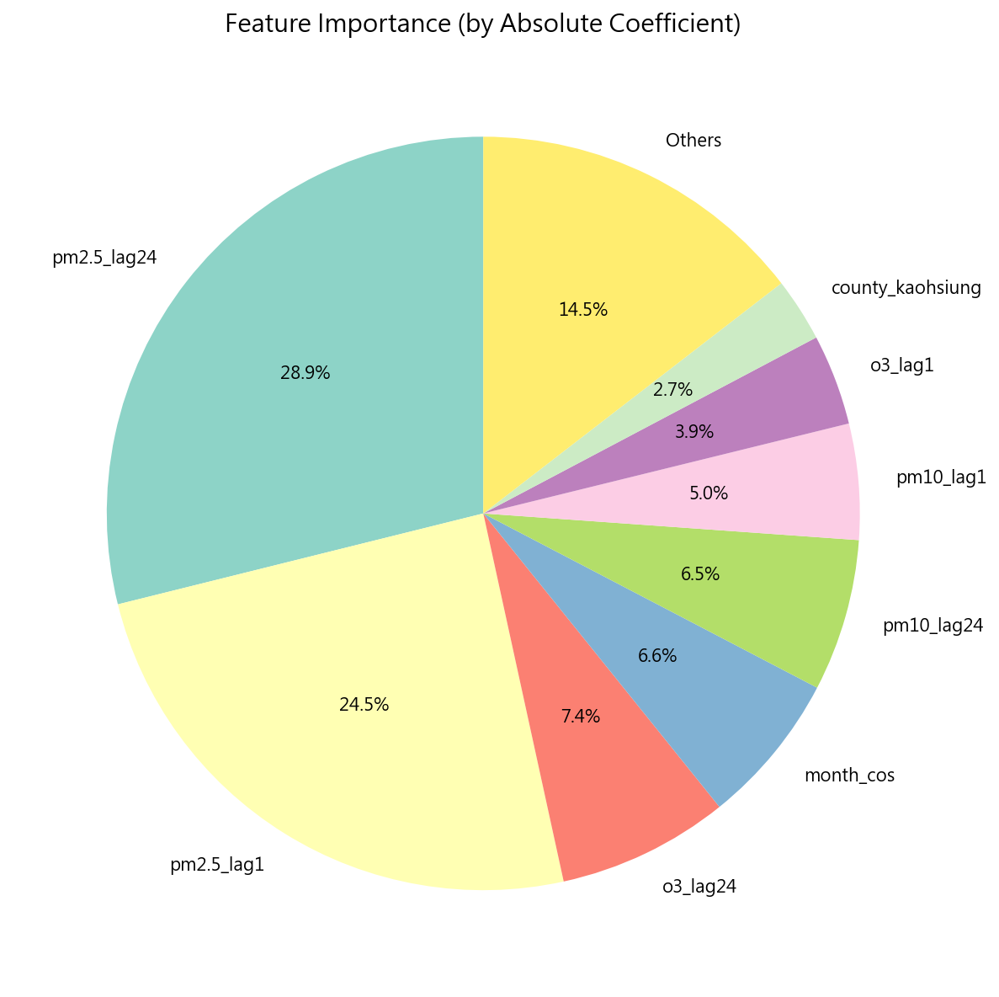
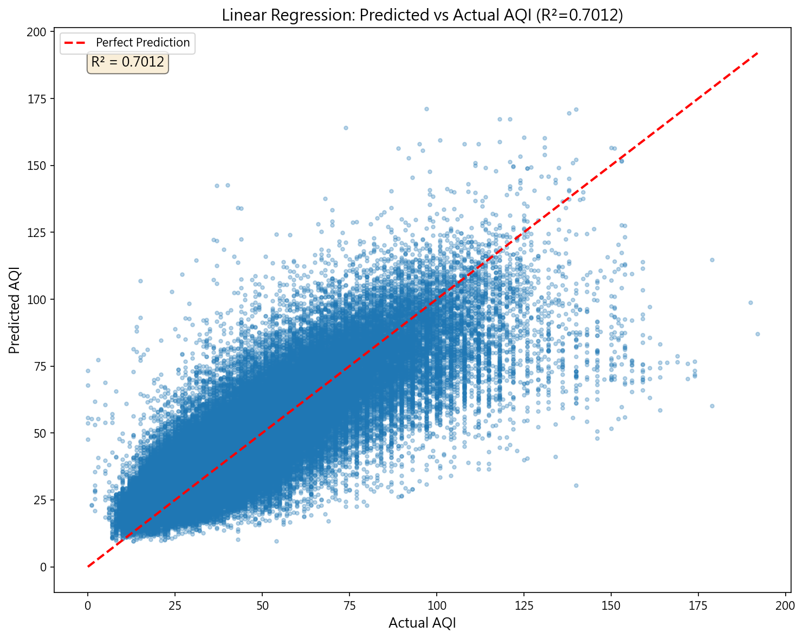
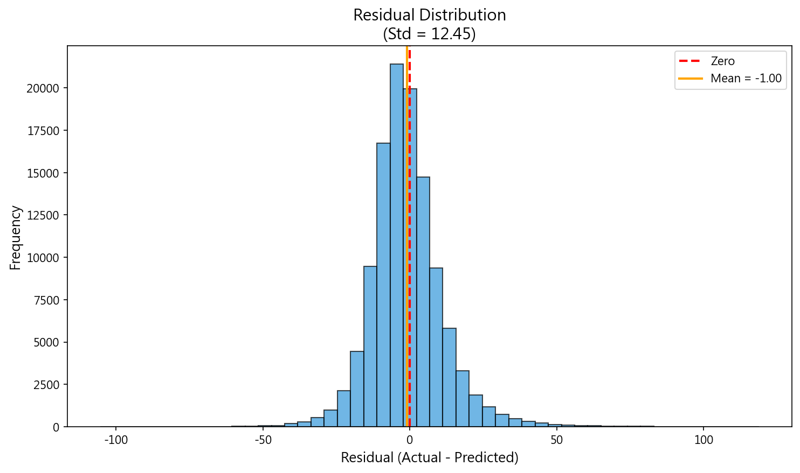
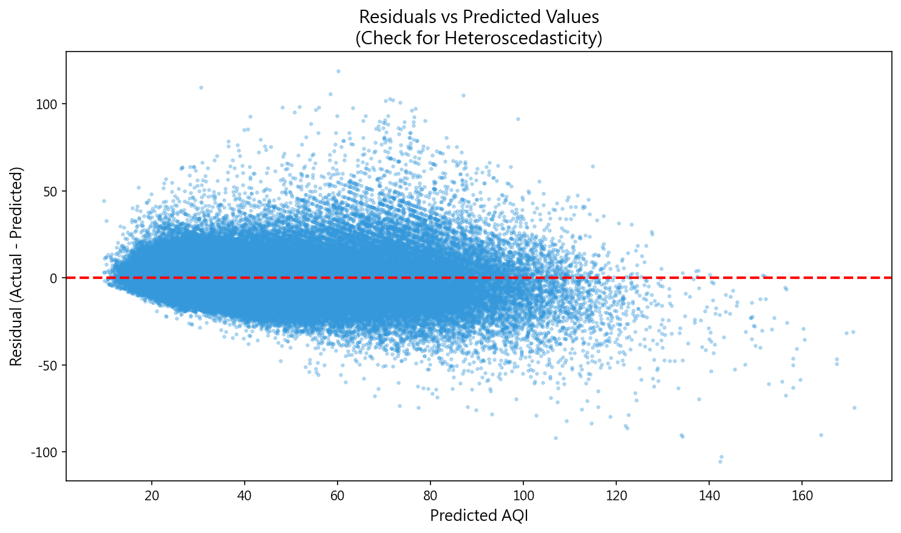

# 線性回歸模型報告

**FR-002: 空氣品質指數 (AQI) 預測模型**

**執行日期**：2026-01-02  
**模型版本**：20260102_113837  
**作者**：潘驄杰

---

## 一、執行方式

本模型使用 Python 的 scikit-learn 套件進行開發與訓練。執行前須確保已完成資料前處理（FR-001），產生訓練、驗證、測試三份資料集。

### 執行指令

開啟終端機，切換至專案根目錄後執行：

```bash
cd d:\AboutCoding\CourseCode\Artificial_Intelligence_Practice_CourseCode\AirQuality

# Create virtual environment : If not created
python -m venv .venv 

# Install dependencies : If not installed
pip install -r requirements.txt

# Activate virtual environment
.venv\Scripts\activate

python src/main/python/models/run_linear_regression.py
```

執行後，所有結果會存放於 `results/linear_regression/YYYYMMDD_HHMMSS/` 資料夾內，其中包含：

- `coefficients.csv` — 迴歸係數表
- `metrics.json` — 評估指標 (R², RMSE, MAE)
- `scatter_plot.png` — 預測值 vs 實際值散點圖
- `coefficients_bar.png` — 係數條形圖
- `residuals_hist.png` — 殘差分佈直方圖
- `residuals_scatter.png` — 殘差 vs 預測值散點圖
- `feature_importance_pie.png` — 特徵重要性圓餅圖
- `model.joblib` — 可重新載入的模型檔

---

## 二、線性回歸計算與訓練方式

### 2.1 模型原理

線性回歸是一種監督式學習演算法，用於預測連續性數值。其核心假設是目標變數（AQI）與特徵變數之間存在線性關係，數學表示式為：

$$
\text{AQI} = \beta_0 + \beta_1 x_1 + \beta_2 x_2 + \cdots + \beta_n x_n + \varepsilon
$$

其中 $\beta_0$ 為截距，$\beta_1 \sim \beta_n$ 為各特徵的迴歸係數，$\varepsilon$ 為隨機誤差項。

### 2.2 求解方法

本模型使用**封閉形式解 (Closed-form Solution)**，又稱為**最小平方法 (Ordinary Least Squares, OLS)**。其解析解公式為：

$$
\boldsymbol{\beta} = (\mathbf{X}^T \mathbf{X})^{-1} \mathbf{X}^T \mathbf{y}
$$

此方法直接計算最優係數，不需要迭代優化，因此**不使用 GPU**，而是透過 CPU 進行矩陣運算。對於線性回歸問題，這種解析方法比迭代式訓練（如梯度下降）更快速且精確。

### 2.3 特徵標準化

為了使各特徵的係數可以直接比較重要性，本模型在訓練前先對所有數值特徵進行標準化處理：

$$
x_{\text{standardized}} = \frac{x - \mu}{\sigma}
$$

標準化後的特徵均值為 0、標準差為 1，此時迴歸係數的絕對值即可反映該特徵對 AQI 的相對影響程度。

### 2.4 使用特徵

本模型共使用 18 個特徵，分為四大類：

1. **污染物滯後特徵**（避免資料洩漏）：
   - pm2.5_lag1, pm10_lag1, o3_lag1 — 前一小時的污染物濃度
   - pm2.5_lag24, pm10_lag24, o3_lag24 — 前一天同時刻的污染物濃度

2. **氣象特徵**：windspeed（風速）

3. **時間週期特徵**（正弦/餘弦編碼）：
   - hour_sin, hour_cos, month_sin, month_cos

4. **類別特徵**（One-Hot 編碼）：
   - 季節：season_spring, season_summer, season_autumn, season_winter
   - 縣市：county_new_taipei, county_changhua, county_kaohsiung

---

## 三、模型評估結果

### 3.1 資料集規模

| 資料集 | 樣本數 | 時間範圍 |
|--------|--------|----------|
| 訓練集 | 1,492,716 | 2017-2022 年 |
| 驗證集 | 114,978 | 2023 年上半年 |
| 測試集 | 114,979 | 2023 年下半年 |

### 3.2 評估指標

| 指標 | 訓練集 | 驗證集 | 測試集 |
|------|--------|--------|--------|
| **R² (決定係數)** | 0.7596 | 0.7162 | **0.7012** |
| **RMSE (均方根誤差)** | 15.85 | 14.46 | 12.49 |
| **MAE (平均絕對誤差)** | 11.33 | 10.66 | 9.06 |

**R² = 0.70** 表示模型能夠解釋約 70% 的 AQI 變異量，屬於**可接受的擬合程度** (0.5 ≤ R² < 0.75)。模型在測試集上的表現略低於訓練集，顯示輕微的過擬合，但差距在合理範圍內。

---

## 四、特徵係數分析

### 4.1 係數條形圖



#### 📖 如何閱讀此圖

此圖為水平條形圖，用於視覺化各特徵的迴歸係數。閱讀方式如下：

- **橫軸（X 軸）**：表示標準化後的迴歸係數 β 值。正值表示該特徵與 AQI 呈正相關（特徵增加 → AQI 上升），負值則為負相關。
- **縱軸（Y 軸）**：列出所有 18 個特徵名稱，按係數值由小到大排列。
- **條形顏色**：紅色代表正係數（正向影響），藍色代表負係數（負向影響）。
- **條形長度**：長度越長表示影響程度越大，係數的絕對值越高。

#### 🔍 圖表特徵與發現

1. **PM2.5 滯後特徵佔據主導地位**：pm2.5_lag24（+11.98）和 pm2.5_lag1（+10.18）的係數遠大於其他特徵，形成明顯的「長尾」效應。這說明過去的 PM2.5 濃度是預測當前 AQI 最重要的因素，符合空氣污染的時間持續性特徵。

2. **正負分佈不對稱**：大部分特徵為正係數（14 個），僅少數為負係數（4 個）。負係數特徵包括 county_new_taipei、season_summer、county_changhua、season_winter，暗示這些地區或季節的 AQI 相對較低。

3. **時間特徵的影響**：month_cos（+2.72）的係數較高，反映冬季（餘弦函數在 12-1 月達峰值）AQI 偏高的季節效應。

4. **風速的反直覺結果**：windspeed 係數為正（+0.72），但位於係數排行的中後段，影響相對不顯著。

---

### 4.2 特徵重要性排名

根據係數絕對值排序，前五大影響因子為：

| 排名 | 特徵 | 標準化係數 | 解釋 |
|------|------|------------|------|
| 1 | pm2.5_lag24 | +11.98 | **前一天同時刻的 PM2.5 濃度最具預測力** |
| 2 | pm2.5_lag1 | +10.18 | 前一小時的 PM2.5 濃度次之 |
| 3 | o3_lag24 | +3.05 | 前一天的臭氧濃度 |
| 4 | month_cos | +2.72 | 月份的餘弦編碼（反映冬季效應） |
| 5 | pm10_lag24 | +2.71 | 前一天的 PM10 濃度 |

---

### [報告不須呈現] 4.3 特徵重要性圓餅圖



#### 📖 如何閱讀此圖

此圖為圓餅圖，用於展示各特徵對 AQI 預測的**相對貢獻比例**。閱讀方式如下：

- **扇區大小**：每個扇區的面積代表該特徵係數絕對值佔總和的比例。扇區越大，該特徵對 AQI 預測的貢獻越高。
- **百分比標籤**：每個扇區標註其佔比，便於快速比較各特徵的重要性。
- **「Others」區塊**：為簡化視覺化，係數較小的特徵被歸入「其他」類別。

#### 🔍 圖表特徵與發現

1. **PM2.5 滯後特徵合計佔比超過 50%**：pm2.5_lag24（約 27%）+ pm2.5_lag1（約 23%）≈ 50%。這表示預測 AQI 時，一半以上的資訊來自過去的 PM2.5 濃度，說明 PM2.5 是空氣品質的核心指標。

2. **污染物類特徵合計佔比約 70%**：加上 o3_lag24、pm10_lag24、pm10_lag1、o3_lag1，污染物滯後特徵合計佔據約七成的預測力，印證 AQI 計算本身就是以污染物濃度為基礎。

3. **時間與地點特徵佔比約 30%**：month_cos、季節 One-Hot、縣市 One-Hot 等特徵合計約三成，表示「何時」與「何處」對 AQI 仍有顯著但次要的影響。

4. **風速影響極小**：windspeed 佔比僅約 1.6%，在考慮其他因素後，風速對 AQI 的獨立影響相當有限。

---

## 五、模型預測分析

### 5.1 預測值 vs 實際值散點圖



#### 📖 如何閱讀此圖

此圖為散點圖，用於評估模型預測的準確性。閱讀方式如下：

- **橫軸（X 軸）**：實際 AQI 值（測試集中的真實數據）。
- **縱軸（Y 軸）**：模型預測的 AQI 值。
- **紅色虛線**：代表完美預測線（y = x）。若所有點都落在這條線上，表示模型預測完全正確。
- **點的密度**：點越密集的區域，表示該 AQI 範圍的樣本越多。
- **R² 標註**：左上角顯示決定係數 R² = 0.7012。

#### 🔍 圖表特徵與發現

1. **主要預測群集在 AQI 40-70 區間**：圖中點最密集的區域位於實際值 40-70、預測值 40-70 的正方形區塊。這反映資料集中大部分時段的空氣品質屬於「良好」至「普通」等級，模型在這個常見範圍表現最佳。

2. **高 AQI 區間呈現「扇形擴散」**：當實際 AQI 超過 100 時，預測點明顯偏離紅線且向下分佈，形成扇形。這表示模型對高污染事件傾向低估，可能原因是：
   - 極端污染事件樣本較少，模型缺乏學習機會
   - 線性模型無法捕捉非線性的污染累積效應

3. **低 AQI 區間輕微高估**：當實際 AQI 低於 30 時，預測點多位於紅線上方，表示模型略為高估。這反映「最優良空氣品質」的特殊條件未被模型完整學習。

4. **整體分佈呈橢圓形**：散點大致沿紅線分佈成橢圓形，顯示模型具備基本的預測能力，但存在一定程度的離散誤差。

5. **R² = 0.70 的實際意義**：模型解釋了 70% 的 AQI 變異量，剩餘 30% 可能來自未納入的因素（如即時氣象變化、突發排放事件等）或線性模型的本質限制。

---

### 5.2 殘差分析

殘差（Residual）定義為實際值減去預測值：$\text{Residual} = \text{Actual} - \text{Predicted}$。殘差分析是診斷迴歸模型品質的重要工具。

#### 殘差分佈直方圖



#### 📖 如何閱讀此圖

此圖為直方圖，用於展示殘差的分佈形態。閱讀方式如下：

- **橫軸（X 軸）**：殘差值，正值表示模型低估（實際 > 預測），負值表示高估（實際 < 預測）。
- **縱軸（Y 軸）**：該殘差區間的樣本數量（頻率）。
- **紅色虛線**：殘差 = 0 的位置，理想情況下分佈應以此為中心。
- **橘色實線**：殘差的平均值。

#### 🔍 圖表特徵與發現

1. **分佈近似常態**：直方圖呈現鐘形曲線，以 0 為中心對稱分佈，符合線性回歸的基本假設（殘差應為常態分佈）。

2. **平均值接近 0**：殘差均值約為 0，表示模型沒有系統性的偏差（既非一貫高估，也非一貫低估）。

3. **標準差約 12.5**：大部分殘差落在 ±25 的範圍內（約 2 個標準差），表示預測誤差在可接受範圍。

4. **存在少量極端殘差**：圖表兩端有極少數殘差超過 ±50，這些對應到模型嚴重誤判的案例（如突發污染事件）。

5. **右尾略長**：正殘差一側的尾巴略長於負殘差側，暗示模型對高 AQI 的低估比對低 AQI 的高估更常見。

---

#### 殘差 vs 預測值散點圖



#### 📖 如何閱讀此圖

此圖用於檢測**異質變異性（Heteroscedasticity）**，即殘差的變異量是否隨預測值改變。閱讀方式如下：

- **橫軸（X 軸）**：模型預測的 AQI 值。
- **縱軸（Y 軸）**：對應的殘差值。
- **紅色虛線**：殘差 = 0 的水平線。理想情況下，點應隨機分佈在此線上下。
- **點的垂直分佈寬度**：若寬度隨橫軸位置變化，則存在異質變異性。

#### 🔍 圖表特徵與發現

1. **中央區域殘差分佈均勻**：預測值在 40-70 範圍時，殘差在 ±20 範圍內均勻分佈，顯示模型在這個區間表現穩定。

2. **邊緣區域變異增大**：
   - 預測值 < 30：殘差以正值為主（低估居多）
   - 預測值 > 80：殘差變異明顯擴大，出現較多極端殘差

3. **輕微的「漏斗狀」型態**：殘差分佈呈現左窄右寬的趨勢，暗示存在異質變異性。這表示線性模型對高 AQI 預測的不確定性較大。

4. **無明顯曲線趨勢**：殘差沒有呈現拋物線或其他曲線形式，表示線性假設基本成立，不存在嚴重的非線性遺漏。

5. **改進建議**：針對異質變異性，可考慮對目標變數進行對數轉換（log-transform）或使用加權最小平方法（WLS）來改善模型。

---

## 六、發現與討論

### 6.1 期中假設驗證

期中報告假設「風速增加會使 AQI 降低」，然而本次模型結果顯示 **windspeed 係數為 +0.72（正值）**，與假設相反。

**可能解釋**：

1. **共線性效應**：當模型已包含 PM2.5 等強預測因子後，風速對 AQI 的獨立影響被「吸收」。在多元回歸中，控制其他變數後，單一變數的係數可能與雙變數相關分析不同。

2. **係數相對較小**：windspeed 的標準化係數僅 0.72，排名第 14，遠小於 PM2.5_lag24 的 11.98。這表示風速雖為正向影響，但其重要性相對較低。

### 6.2 時間週期性

月份的餘弦編碼（month_cos = +2.72）顯示顯著的季節效應。餘弦函數在冬季（12月-1月）達到最大值，這與冬季空氣品質較差的現象吻合——冬季大氣穩定度高、境外污染物傳輸頻繁，導致 AQI 偏高。

### 6.3 地區差異

縣市係數反映地區差異：
- **高雄 (county_kaohsiung = +1.13)**：AQI 偏高
- **新北 (county_new_taipei = -0.92)**：AQI 偏低
- **彰化 (county_changhua = -0.32)**：AQI 略低

這與地理位置、工業分佈及氣候條件相符合。高雄為重工業城市，污染源較多；新北受東北季風調節，擴散條件較佳。

---

## 七、結論

本線性回歸模型成功建立 AQI 預測系統，測試集 R² 達 0.70，能夠解釋大部分的 AQI 變異。主要發現如下：

1. **PM2.5 滯後特徵是最強預測因子**：前一天同時刻與前一小時的 PM2.5 濃度貢獻超過 50% 的預測力。

2. **季節效應顯著**：冬季 AQI 普遍較高，符合大氣科學理論。

3. **地區差異明確**：高雄 AQI 高於新北與彰化。

4. **模型限制**：線性模型在極端 AQI 值的預測能力較弱，未來可考慮使用決策樹或隨機森林等非線性模型改善。

---

## 附錄：檔案清單

| 檔案名稱 | 說明 |
|----------|------|
| `coefficients.csv` | 完整係數表 |
| `metrics.json` | 評估指標 (JSON 格式) |
| `scatter_plot.png` | 預測 vs 實際散點圖 |
| `coefficients_bar.png` | 係數條形圖 |
| `residuals_hist.png` | 殘差分佈直方圖 |
| `residuals_scatter.png` | 殘差 vs 預測值散點圖 |
| `feature_importance_pie.png` | 特徵重要性圓餅圖 |
| `model.joblib` | 可載入模型檔 |

---

*報告結束*
