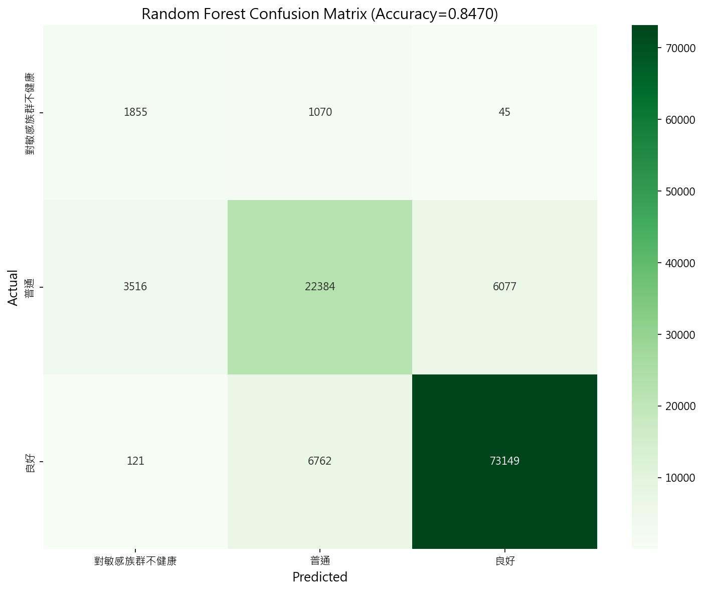
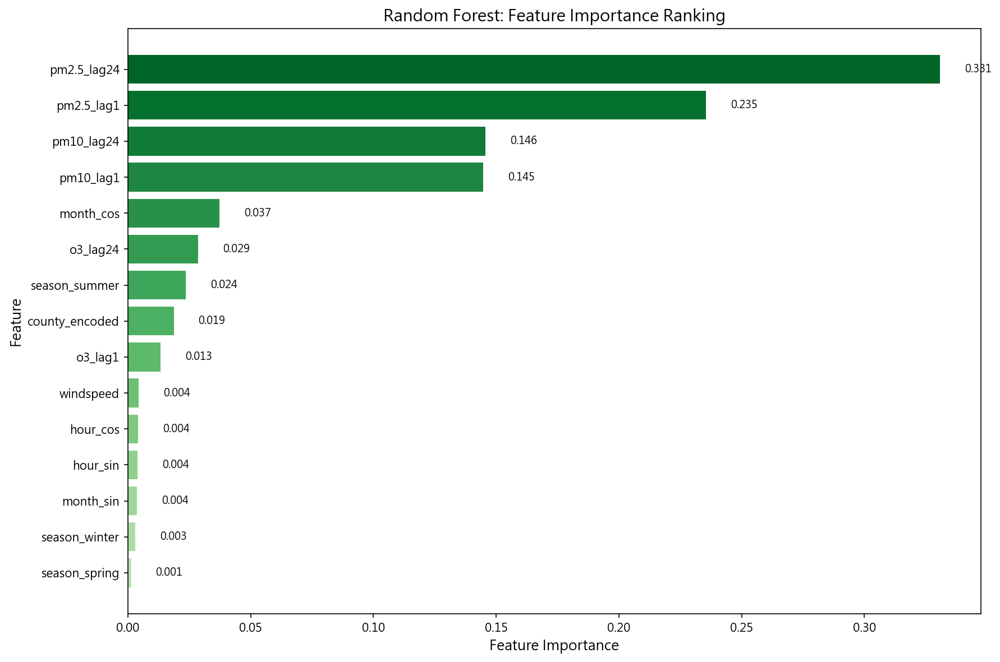
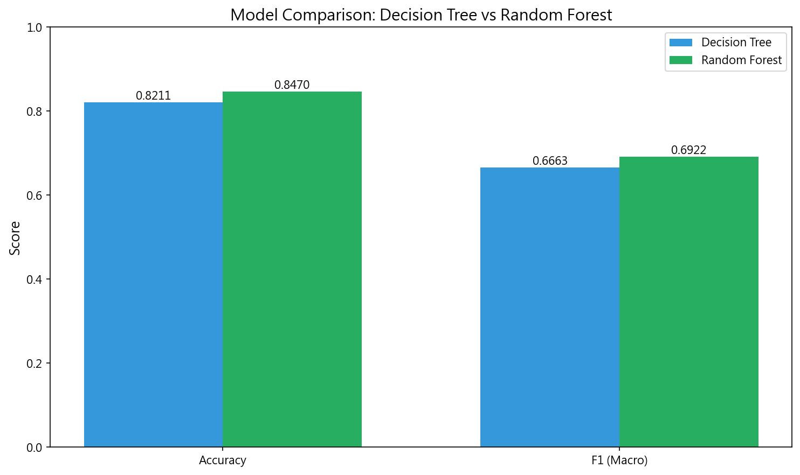

# 隨機森林模型報告

**FR-004: 空氣品質等級 (AQI Level) 分類模型**

**執行日期**：2026-01-02  
**模型版本**：20260102_123454  
**作者**：潘驄杰

---

## 一、執行方式

本模型使用 Python 的 scikit-learn 套件進行開發與訓練。執行前須確保已完成資料前處理（FR-001），產生訓練、驗證、測試三份資料集。

### 執行指令

開啟終端機，切換至專案根目錄後，使用虛擬環境執行：

```bash
cd d:\AboutCoding\CourseCode\Artificial_Intelligence_Practice_CourseCode\AirQuality

# Create virtual environment : If not created
python -m venv .venv 

# Install dependencies : If not installed
pip install -r requirements.txt

# Activate virtual environment
.venv\Scripts\activate

python src/main/python/models/run_random_forest.py
```

執行後，所有結果會存放於 `results/random_forest/YYYYMMDD_HHMMSS/` 資料夾內，其中包含：

- `confusion_matrix.png` — 混淆矩陣熱力圖
- `feature_importance.png` — 特徵重要性條形圖
- `feature_importance.csv` — 特徵重要性表格
- `metrics.json` — 評估指標 (Accuracy, F1, OOB Score)
- `model_comparison.png` — 與決策樹的比較圖
- `model_comparison.md` — 模型比較報告
- `model.joblib` — 可重新載入的模型檔

---

## 二、隨機森林計算與訓練方式

### 2.1 模型原理

隨機森林（Random Forest）是一種**集成學習（Ensemble Learning）**演算法，透過建立多棵決策樹並綜合其預測結果來提高準確度與穩定性。核心思想是「三個臭皮匠勝過一個諸葛亮」——結合多個弱學習器可以得到更強的預測能力。

其運作原理如下：

1. **Bootstrap 抽樣**：從原始訓練資料中，透過有放回抽樣（bootstrap）產生 $n$ 組子集。
2. **決策樹建構**：每棵樹使用不同的子集進行訓練，並在每次分裂時只考慮隨機選取的部分特徵。
3. **投票機制**：預測時，所有樹對輸入樣本進行分類，最終採用**多數決投票**決定輸出類別。

$$
\hat{y} = \text{mode} \{ h_1(\mathbf{x}), h_2(\mathbf{x}), \ldots, h_n(\mathbf{x}) \}
$$

其中 $h_i$ 為第 $i$ 棵決策樹的預測結果，$\text{mode}$ 為眾數函數。

### 2.2 OOB 分數（Out-of-Bag Score）

隨機森林的獨特優勢是**無需額外驗證集**即可估計模型泛化能力。由於 Bootstrap 抽樣中約有 37% 的樣本未被抽中（稱為 OOB 樣本），這些樣本可用於評估模型效能。

OOB Score 是一種**無偏的交叉驗證估計**，其優點包括：
- 不須切分額外驗證集
- 計算效率高
- 可避免資料洩漏

### 2.3 超參數設定

本模型的超參數設定依據課程規格（02-models.md）：

| 參數 | 設定值 | 說明 |
|------|--------|------|
| `n_estimators` | 100 | 森林中的決策樹數量 |
| `max_depth` | 10 | 每棵樹的最大深度 |
| `class_weight` | 'balanced' | 自動調整類別權重以處理不平衡 |
| `n_jobs` | -1 | 使用所有 CPU 核心加速訓練 |
| `oob_score` | True | 啟用 OOB 分數計算 |

### 2.4 使用特徵

本模型共使用 16 個特徵，分為四大類：

1. **污染物滯後特徵**（避免資料洩漏）：
   - pm2.5_lag1, pm10_lag1, o3_lag1 — 前一小時的污染物濃度
   - pm2.5_lag24, pm10_lag24, o3_lag24 — 前一天同時刻的污染物濃度

2. **氣象特徵**：windspeed（風速）

3. **時間週期特徵**（正弦/餘弦編碼）：
   - hour_sin, hour_cos, month_sin, month_cos

4. **類別特徵**：
   - 季節 One-Hot：season_spring, season_summer, season_autumn, season_winter
   - 縣市 Label Encoding：county_encoded（樹模型可使用 Label Encoding）

---

## 三、模型評估結果

### 3.1 資料集規模

| 資料集 | 樣本數 | 時間範圍 |
|--------|--------|----------|
| 訓練集 | 1,492,716 | 2017-2022 年 |
| 驗證集 | 114,978 | 2023 年上半年 |
| 測試集 | 114,979 | 2023 年下半年 |

### 3.2 類別分佈

| 類別 | 訓練集數量 | 訓練集佔比 |
|------|------------|------------|
| 良好 | 735,778 | 49.3% |
| 普通 | 585,245 | 39.2% |
| 對敏感族群不健康 | 171,693 | 11.5% |

### 3.3 評估指標

| 指標 | 訓練集 | 驗證集 | 測試集 |
|------|--------|--------|--------|
| **Accuracy** | 79.61% | 77.94% | **84.70%** ✅ |
| **F1 (Macro)** | 76.42% | 73.94% | 69.22% |
| **OOB Score** | 79.36% | - | - |

**Accuracy = 84.70%** 達到 FR-004 的目標（> 80%），表示模型具備良好的分類能力。OOB Score (79.36%) 與驗證集 Accuracy (77.94%) 相近，顯示 OOB 是可靠的泛化能力估計。

---

## 四、混淆矩陣分析

### 4.1 混淆矩陣熱力圖



#### 📖 如何閱讀此圖

混淆矩陣是分類模型效能評估的核心工具，用於呈現預測結果與實際類別的對照關係。閱讀方式如下：

- **橫軸（X 軸）**：模型預測的類別（Predicted）
- **縱軸（Y 軸）**：實際的類別（Actual）
- **對角線數值**：正確分類的樣本數（深色區塊）
- **非對角線數值**：錯誤分類的樣本數（淺色區塊）
- **顏色深淺**：數值越大，顏色越深（綠色色階）

#### 🔍 圖表特徵與發現

1. **「良好」類別預測最準確**：對角線上「良好」的數值最大（73,149），且佔該類實際樣本的 91.4%。這反映模型對優質空氣品質的識別能力最強。

2. **「普通」類別存在混淆**：實際為「普通」的 31,977 筆樣本中，有 6,077 筆（19.0%）被誤判為「良好」，3,516 筆（11.0%）被誤判為「對敏感族群不健康」。「普通」作為中間類別，邊界較模糊。

3. **「對敏感族群不健康」樣本稀少**：此類別僅 2,970 筆測試樣本，佔比最低（2.6%）。模型正確識別 1,855 筆（62.5%），但仍有 1,070 筆（36.0%）被誤判為「普通」。

4. **類別不平衡影響**：三類樣本數比例約為 27:11:1（良好:普通:不健康），儘管使用了 `class_weight='balanced'`，少數類別的召回率仍受限。

5. **無嚴重誤判**：「良好」幾乎不會被誤判為「對敏感族群不健康」（僅 121 筆），反之亦然（僅 45 筆）。這表示模型能正確區分極端類別，僅在相鄰類別間發生混淆。

---

## 五、特徵重要性分析

### 5.1 特徵重要性條形圖



#### 📖 如何閱讀此圖

此圖為水平條形圖，展示隨機森林計算出的各特徵重要性分數。閱讀方式如下：

- **橫軸（X 軸）**：特徵重要性分數（0 到 1 之間，所有特徵加總為 1）
- **縱軸（Y 軸）**：特徵名稱，依重要性由高到低排列
- **條形長度**：長度越長表示該特徵對分類的貢獻越大
- **顏色漸層**：由淺到深代表重要性由低到高

隨機森林的特徵重要性計算基於**平均不純度減少（Mean Decrease in Impurity, MDI）**：統計每個特徵在所有決策樹中用於分裂節點時，所帶來的 Gini 不純度減少量之平均值。

#### 🔍 圖表特徵與發現

1. **PM2.5 滯後特徵主導預測力**：pm2.5_lag24（33.1%）與 pm2.5_lag1（23.5%）合計佔 56.6%，構成模型的核心預測基礎。這符合 AQI 計算公式中 PM2.5 的權重最高這一事實。

2. **Lag-24 優於 Lag-1**：pm2.5_lag24 的重要性（33.1%）高於 pm2.5_lag1（23.5%），表示**日週期模式（Diurnal Pattern）**比短期趨勢更具預測價值。前一天同時刻的污染狀況，比前一小時更能預測當前的空氣品質等級。

3. **PM10 貢獻次之**：pm10_lag24（14.6%）與 pm10_lag1（14.5%）合計約 29%，為第二重要的污染物類別。PM2.5 與 PM10 合計貢獻約 85% 的預測力。

4. **臭氧與時間特徵貢獻較低**：o3_lag24（2.9%）、month_cos（3.7%）、season_summer（2.4%）等特徵貢獻僅個位數百分比，顯示這些因素對 AQI 等級分類的影響相對次要。

5. **風速幾乎無貢獻**：windspeed 僅佔 0.44%，在控制污染物濃度後，風速對 AQI 等級的獨立影響極小。這與線性回歸報告的發現一致。

### 5.2 特徵重要性排名表

| 排名 | 特徵 | 重要性 | 說明 |
|------|------|--------|------|
| 1 | pm2.5_lag24 | 33.08% | **前一天同時刻 PM2.5 濃度** |
| 2 | pm2.5_lag1 | 23.54% | 前一小時 PM2.5 濃度 |
| 3 | pm10_lag24 | 14.57% | 前一天同時刻 PM10 濃度 |
| 4 | pm10_lag1 | 14.48% | 前一小時 PM10 濃度 |
| 5 | month_cos | 3.74% | 月份週期編碼（冬季效應） |
| 6 | o3_lag24 | 2.86% | 前一天同時刻臭氧濃度 |
| 7 | season_summer | 2.37% | 夏季指標 |
| 8 | county_encoded | 1.87% | 縣市編碼 |
| 9 | o3_lag1 | 1.33% | 前一小時臭氧濃度 |
| 10 | windspeed | 0.44% | 風速 |

---

## 六、模型比較分析

### 6.1 與決策樹的比較



#### 📖 如何閱讀此圖

此圖為分組條形圖，比較決策樹與隨機森林在相同測試集上的表現。閱讀方式如下：

- **橫軸（X 軸）**：評估指標（Accuracy、F1 Macro）
- **縱軸（Y 軸）**：分數（0 到 1）
- **藍色條形**：決策樹模型
- **綠色條形**：隨機森林模型
- **條形上方數值**：精確分數

#### 🔍 圖表特徵與發現

1. **隨機森林全面優於決策樹**：在 Accuracy 與 F1 兩項指標上，隨機森林（綠色）均高於決策樹（藍色），顯示集成學習的優勢。

2. **Accuracy 提升 2.59%**：隨機森林（84.70%）相比決策樹（82.11%）提升 2.59 個百分點，這在大規模資料集上是顯著的改進。

3. **F1 提升 2.59%**：隨機森林的 F1 Macro（69.22%）同樣優於決策樹（66.63%），表示在處理類別不平衡時也有更好表現。

4. **效能換取可解釋性**：決策樹可以視覺化完整的決策路徑（max_depth=5），而隨機森林包含 100 棵樹且深度為 10，無法直接視覺化。效能提升的代價是可解釋性下降。

### 6.2 模型配置比較

| 參數 | 決策樹 | 隨機森林 |
|------|--------|----------|
| **n_estimators** | 1 | 100 |
| **max_depth** | 5 | 10 |
| **class_weight** | balanced | balanced |
| **Test Accuracy** | 82.11% | **84.70%** |
| **Test F1 (Macro)** | 66.63% | **69.22%** |
| **可解釋性** | ⭐⭐⭐⭐⭐ | ⭐⭐⭐ |

---

## 七、發現與討論

### 7.1 PM2.5 是 AQI 等級的核心決定因子

隨機森林與線性回歸兩種模型均指向相同結論：**PM2.5 滯後特徵是預測 AQI 等級最重要的因素**。

- 隨機森林：pm2.5_lag24 + pm2.5_lag1 = 56.6%
- 線性回歸：pm2.5_lag24 + pm2.5_lag1 ≈ 50%

這符合台灣環保署的 AQI 計算規則——PM2.5 濃度通常是決定 AQI 的關鍵污染物（Critical Pollutant）。

### 7.2 日週期模式的重要性

Lag-24 特徵（前一天同時刻）比 Lag-1 特徵（前一小時）更重要，揭示空氣品質具有顯著的**日週期模式**：

- **早晨通勤高峰**（07:00-09:00）：交通排放導致 PM2.5 上升
- **中午光化學反應**（12:00-14:00）：臭氧濃度達峰值
- **夜間擴散**（20:00-06:00）：污染物逐漸消散

因此，預測今天上午 8 點的 AQI 等級時，昨天上午 8 點的數據比今天上午 7 點的數據更有參考價值。

### 7.3 類別不平衡的挑戰

儘管使用了 `class_weight='balanced'`，「對敏感族群不健康」類別的召回率（62.5%）仍明顯低於「良好」類別（91.4%）。這是因為：

1. **樣本數差距過大**：良好（80,032 筆）vs 不健康（2,970 筆）≈ 27:1
2. **特徵重疊**：邊界樣本的 PM2.5 值可能落在分類閾值附近，難以區分

### 7.4 與期中報告的連結

期中報告觀察到「風速與 AQI 呈負相關」，然而隨機森林的特徵重要性顯示 windspeed 僅佔 0.44%。這暗示：

- 風速與 AQI 的相關性可能是**偽相關（Spurious Correlation）**
- 在控制 PM2.5 等污染物濃度後，風速對 AQI 的獨立影響極小
- 風速可能透過影響 PM2.5 濃度間接影響 AQI，而非直接影響

---

## 八、結論

本隨機森林分類模型成功達成 FR-004 的目標，測試集 Accuracy 達 84.70%，優於決策樹模型 2.59 個百分點。主要發現如下：

1. **PM2.5 滯後特徵佔據超過 56% 的預測力**：模型自動學習到 PM2.5 是決定 AQI 等級的核心因子。

2. **日週期模式優於短期趨勢**：Lag-24 特徵比 Lag-1 更重要，反映空氣品質的 24 小時週期性。

3. **集成學習優於單一模型**：100 棵決策樹的隨機森林，比單一深度為 5 的決策樹效能更佳。

4. **OOB Score 是可靠的驗證指標**：OOB Score（79.36%）與驗證集 Accuracy（77.94%）相近，證實 OOB 可作為泛化能力的替代估計。

5. **模型限制**：少數類別（對敏感族群不健康）的召回率仍有改進空間，未來可考慮採用過採樣（SMOTE）或調整分類閾值。

---

## 附錄：檔案清單

| 檔案名稱 | 大小 | 說明 |
|----------|------|------|
| `confusion_matrix.png` | 65.1 KB | 混淆矩陣熱力圖 |
| `feature_importance.png` | 77.7 KB | 特徵重要性條形圖 |
| `feature_importance.csv` | 0.6 KB | 特徵重要性表格 |
| `metrics.json` | 1.2 KB | 評估指標 (JSON 格式) |
| `model_comparison.png` | 39.6 KB | 模型比較圖 |
| `model_comparison.md` | 1.0 KB | 模型比較報告 |
| `model.joblib` | 52.2 MB | 可載入模型檔 |

---

*報告結束*
